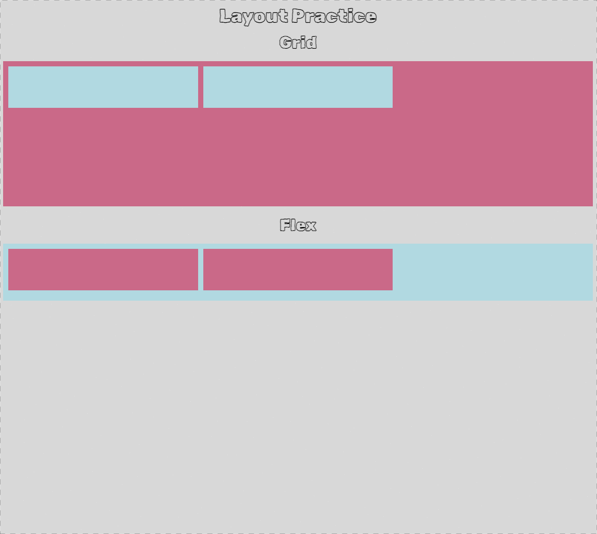

# Vanilla JavaScript AutoComplete Implementation

## Getting Start

```shell
npm install

npm run dev
```

## leaning key points

-   grid
-   flex
-   css selector ( not / nth-child)

## Demonstration


